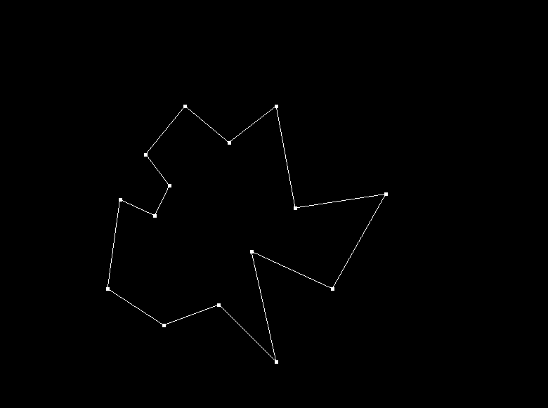
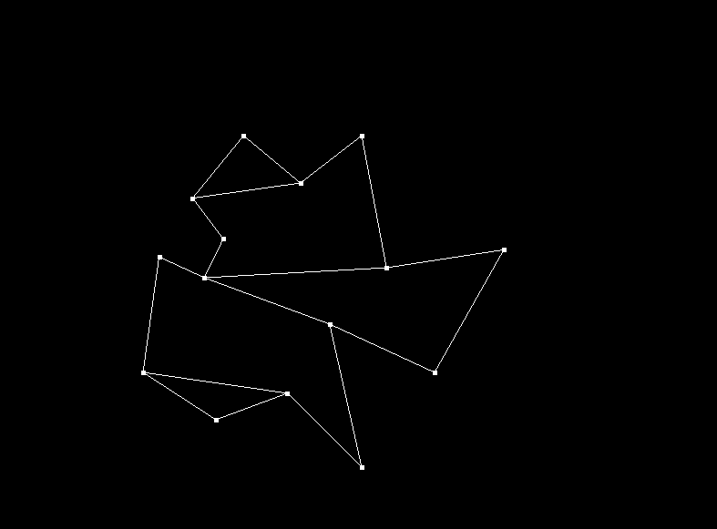
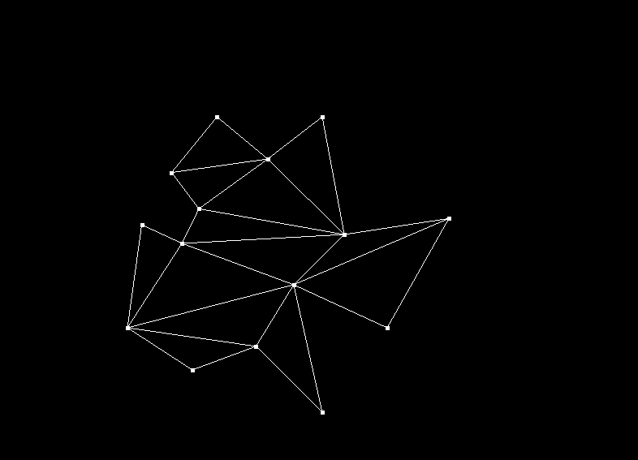

# Polygon triangulation
A polygon triangulation method according to "Mark De Berg: Computational Geometry, Algorithms and Applications (3rd edition)" book

# Initial polygon

# Decomposition of polygon into monotone pieces

# Triangulation of each monotone piece

